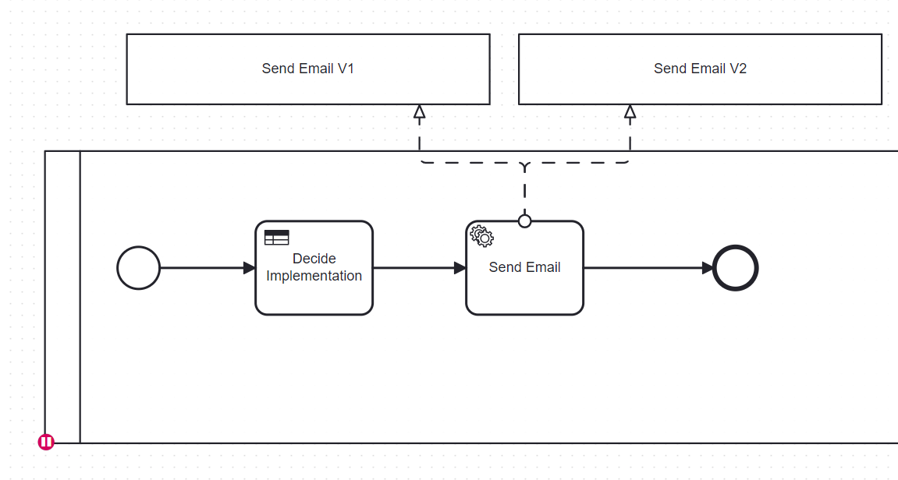

[](https://github.com/Camunda-Community-Hub/community/blob/main/extension-lifecycle.md#stable-)
[](https://github.com/camunda-community-hub/community)


# Canary Deployment

A Canary Deployment consists of deploying a component and sending part of the traffic to this component. If any failure is detected, the original platform must be set up.

This project demonstrates how to do that dynamically with Camunda 8 without stopping the server. It demonstrates the feature on two different artifacts
* on a service task. Deploy a new version of a service task, and send 20 % of traffic to this new service task
* on a process. Deploy a new version of a process and send 15 % of traffic to this new process.

Both do not need to stop the server or change the application.

# Blue-Green versus Canary

## Blue-Green
The Blue-Green deployment strategy involves maintaining two separate environments: Blue and Green. 
At any given time, traffic is routed to one of these environments (e.g., Blue). When a new version is ready, it's deployed to the inactive environment (e.g., Green),
and traffic is switched over to it.

This approach enables easy rollback: if the Green environment encounters issues, traffic can be switched back to Blue quickly.

[BlueGreen](doc/images/BlueGreenEnvironment.png)


## Canary 

In a Canary deployment, both the old and new versions are active simultaneously. Traffic is gradually shifted to the new version based on predefined criteria—such as a percentage of traffic (e.g., 20%) or business logic (e.g., users from a specific region).

Effectively, a Blue-Green deployment is a special case of a Canary deployment with 100% of traffic shifted at once.

This project focuses on the Canary method, as it encompasses the Blue-Green strategy and offers greater flexibility.


# Deployment with Camunda 8

Camunda 8 is not a monolithic application, so it doesn't define environments in the traditional sense. Instead, individual artifacts can be deployed or updated independently.
Different artefacts are subject to be "Canary deployed":
* process. A new version of a process is ready, and some traffic should be sent to this new version
* sub-process. A new version of a process is ready, and it is call by a parent. Some traffic from the parent should be sent to the new sub-process
* worker. A new worker is developed, and some traffic should be sent.

It’s common for these artifacts to be combined: the new process used new version of workers. This new process can be call directly, or from a parent.

# Different solutions

Two options are possibles:
* Deploy wo Clusters with Load Balancer,to send traffic to one server, or another one.

Deploy two separate Camunda 8 clusters and use a load balancer to route traffic. This is a traditional Blue-Green or Canary setup but duplicates the entire environment.

* Single Cluster with Smart Routing

Deploy both versions of artifacts on a single Camunda 8 cluster. Use intelligent routing via variables or frontend applications to control which version is executed.

Camunda 8 supports dynamic deployment and execution of artifacts, making this approach more efficient.

# Principle for each artefact

## Process

A new process is deployed, at a new version. Doing that, all traffic (new creation) is deployed to this new version.
To have a control on that, a "front end" must be used. The application will ask the creation on the front end, and this front end decided which version to used.
This is the Canary applications embedded on this project


## Sub-process

A parent call a sub-process, and some traffic must be re-direct to one sub-process or another one.


There is two ways to implement this request. The main concern here is the "versionTag" is not dynamic in Camunda 8. When this feature will be available, then the same mechanism as the worker can be used.

### Using the processID in FEEL
The process ID in the call activity can be transformed in a FEEL expression.


This variable pilot the sub-process to call.


**Advantages**: the parent does not change

**Concerns**: the sub-process must have a different name, and not a new version.


### Using the version Tag

The version Tag is a constant. So calling the version 1 is a constant in the parent. 

To call the version 2, a new version of the PARENT must be deployed


Splitting the traffic between sub-process consist of split the traffic between parents.


**Advantages**: the sub-process uses versions

**Concerns**: parent must be redeployed, even this is not here where the main change occures. For a sub-process, it may exist a lor of parents

## Worker
A worker can be call dynamically


Doing that, it's possible to control which implementation can be used, using the variable to specify the job type. The two workers are deploying in the cluster, registering with a different job-type.


The worker to call can be decided by an application in front like the CanaryApps. This method is the less intrusive in the process.


or by different methods, for example by a DMN table.


Or directly in the FEEL expression


# This project

The CanaryApp included in this project acts as a proxy for the Zeebe Gateway. It enriches process instances with routing variables based on rules. Business applications call the CanaryApp, which decides how to route execution within the Camunda 8 cluster.


# Different functions
This project builds an application. This application contains multiple functions to demonstrate different steps.

A Kubernetes folder (k8) contains all the different Kubernetes files needed to start the component. This is the same image but with a different configuration.

This is why different Kubernetes deployments are present in the k8 folder: they can start one pod running only one function.

## canaryDeployment
This application is a load balancer between version processes. It offers the same API as the REST Zeebe Gateway, but rules can be onboard to load balance traffic between different versions of the same process, per percentage.


## customer application Ruby
The Ruby application simulates a customer application, which creates process instances.

## Workers
The workers define different workers

# Build

Rebuilt the image via
````
mvn clean install
docker build -t pierre-yves-monnet/canarydeployment:1.0.1 .
docker tag pierre-yves-monnet/canarydeployment:1.0.1 ghcr.io/camunda-community-hub/canarydeployment:1.0.1
docker push ghcr.io/camunda-community-hub/canarydeployment:1.0.1

docker tag pierre-yves-monnet/canarydeployment:1.0.1 ghcr.io/camunda-community-hub/canarydeployment:latest
docker push ghcr.io/camunda-community-hub/canarydeployment:latest


````

The docker image is built using the Dockerfile present on the root level.


Push the image to
```
ghcr.io/camunda-community-hub/process-execution-automator:
```


# Scenario
This section explains how to demonstrate a canary deployment step-by-step

## Initial platform
For all scenarios, a Camunda 8.6 platform is up and running. The values.yaml used is
```yaml

global:
  identity:
    auth:
      enabled: false

identity:
  enabled: false

identityPostgresql:
  enabled: false

prometheusServiceMonitor:
  enabled: true
```

A Grafana page is started and is accessible.
```shell
kubectl get svc -n default
CLUSTER-IP       EXTERNAL-IP   PORT(S)             AGE
kubernetes                              ClusterIP      34.118.224.1     <none>        443/TCP             53d
metrics-grafana                         ClusterIP      34.118.239.223   <none>        80/TCP              53d
metrics-grafana-loadbalancer            LoadBalancer   34.118.226.41    34.23.97.79   80:32264/TCP        53d
```

Check the external IP and start the browser on it (http://34.23.97.79)

Visit https://github.com/camunda-community-hub/camunda-8-helm-profiles/blob/3c54b0f33191b65de6451c4675e23cd00366e2a9/metrics

# Service Task Canary
Access the procedure
[README.md](doc/CanaryServiceTask/README.md)

# Process Canary
Access the procedure
[README.md](doc/CanaryProcess/README.md)