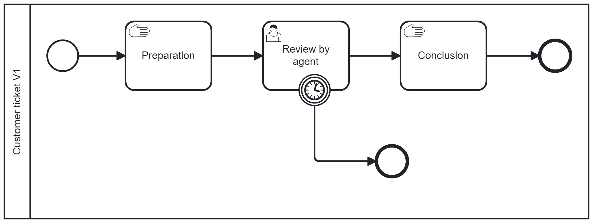

# Canary Process demonstration

# Please check the initial platform.
A Camunda 8 is started, and the Grafana page is accessible.

# Principle
The creation is sent not to the Zeebe Gateway but to the CanaryApplication.
This application offers the same API as the ZeebeGateway, so using this application is entirely transparent.


The redirection rule can be applied to this application. The key to the rule is the processId.
If there is no rule for a process ID, the application sends the order directly to the ZeebeGateway.

A rule contains conditions. At this moment, the condition is only based on a percentage.

```json
{
  "processId": "CustomerTickets",
  "conditions": [
    {
      "percent": 20,
      "versionTag": "V1",
      "version": 1
    },
    {
      "percent": 80,
      "versionTag": "V2",
      "version": 2
    }
  ]
}
```

This rule sends 20% of process creation to version V1 and 80% to version V2.


ATTENTION
Camunda 8.6 does not offer an API to retrieve the version number from the version Tag. So, it's mandatory to give the actual version of the rule.

# Preparation
Deploy the process

1. Deploy the process `src/test/resources/Process/CustomerTicket-V1.bpmn`, from the modeler.
   

2. Start the Canary application
```shell
kubectl create -f k8/CanaryProcess/CanaryApplication.yaml
```

Check that the application is started.
```
2024-10-22T23:39:43.861Z  INFO 1 --- [           main] i.c.c.canary.CanaryApplication           : InitCanaryApplication - enabled[true]
2024-10-22T23:39:43.966Z  INFO 1 --- [           main] i.c.c.c.RubyApplication                  : InitRubyApplication - enabled[false]
2024-10-22T23:39:43.970Z  INFO 1 --- [           main] i.c.c.worker.WorkerApplication           : Init WorkerApplication - enabled[false]
```


Port forward the Canary application to access the service
```shell
kubectl port-forward svc/canary-deployment 8095:8095 -n camunda
```

Access the rule via a browser on
http://localhost:8095/canary/rules

or via
````shell
$ curl -X GET http://localhost:8095/canary/rules
[}]$
````
By default, there are no rules.


2. Start the Ruby application

```shell
kubectl create -f k8/CanaryProcess/RubyCustomerTickets.yaml
```

Check the pod starts correctly.

```shell
kubectl logs -f  <PodNameF rubypurchaserequest>
2024-10-22T22:15:57.065Z  INFO 1 --- [           main] i.c.c.c.CustomerApplication              : InitRubyApplication - enabled[true]
2024-10-22T22:15:57.066Z  INFO 1 --- [           main] i.c.c.c.CustomerApplication              : Schedule a task in 12000 ms
```

Check that the canary application received the order and created it.
```` 
2024-10-23T00:54:01.213Z  INFO 1 --- [nio-8095-exec-7] i.c.c.canary.CanaryApplication           : Process-instances created in processId[CustomerTickets] Version[latest] PID[6755399441175488]
2024-10-23T00:54:01.225Z  INFO 1 --- [nio-8095-exec-8] i.c.c.canary.CanaryApplication           : Process-instances created in processId[CustomerTickets] Version[latest] PID[2251799813805029]
2024-10-23T00:54:01.261Z  INFO 1 --- [nio-8095-exec-9] i.c.c.canary.CanaryApplication           : Process-instances created in processId[CustomerTickets] Version[latest] PID[4503599627490256]
````
# Scenario

A new version must be deployed, and only 20 % of the process must be created in this version to validate it.


## Install a new process version

When a new process version is deployed, Camunda will immediately send a new creation on this new process.
To avoid that, a rule is created before the deployment to send 100% of the traffic to the current version.

Via Operate, check the current version of the process.


The current version is 1.

Add the rule via POSTMAN or the CURL.


```shell
curl -X POST http://localhost:8095/canary/addrule \
  -H "Content-Type: application/json" \
  -d '{"processId":"CustomerTickets","conditions":[{"percent":100,"versionTag":"V1","version":1}]}'

```

Response is
```
Rule added? New rule added. Number of rules: 1
```

Check the Grafana page; there is no disruption in the creation


In Operate, the number of process instances in the first process continues to grow.

Looking at the log-in Canary application, the process version is not the latest now, but version 1
```` 
2024-10-23T01:01:29.584Z  INFO 1 --- [nio-8095-exec-4] i.c.c.canary.CanaryApplication           : Process-instances created in processId[CustomerTickets] Version[1] PID[6755399441186065]
````

Deploy the new version of the process, tagged "V2"

There are now two versions in Operate; the new version has no process instance.


## Send 20 % in the new version

Change the rule to send 20 % in the new version. Via Operate, the new version is named "2"

```shell
curl -X POST http://localhost:8095/canary/addrule \
  -H "Content-Type: application/json" \
  -d '{"processId":"CustomerTickets","conditions":[{"percent":80,"versionTag":"V1","version":1},{"percent":20,"versionTag":"V2","version":2}]}'

```
Result is
```
Rule added? Rule already exists, overrode. Number of rules : 1
```

Check the Grafana page: there is no disruption of service


Check to operate: now process instances appear in the second process


## Send 80 % in the new version

```shell
curl -X POST http://localhost:8095/canary/addrule \
  -H "Content-Type: application/json" \
  -d '{"processId":"CustomerTickets","conditions":[{"percent":20,"versionTag":"V1","version":1},{"percent":80,"versionTag":"V2","version":2}]}'

```
Result is
```
Rule added? Rule already exists, overrided Number of rules : 1
```

Now, the new process receives more process instances.


At any time, you can check the rules
```shell
curl -X GET http://localhost:8095/canary/rules
[{"processId":"CustomerTickets","conditions":[{"percent":20,"versionTag":"V1","version":1},{"percent":80,"versionTag":"V2","version":2}]}]
```

## Put the new version in production
To send all the data in the new process, delete the rule

```shell
curl -X POST http://localhost:8095/canary/deleterule/CustomerTickets 
```

Answer is
```
Rule Deleted. Number of rules : 0
```

Check with Operate: no more process instance is created in process version 1


Verify the complete throughput via Grafana:


## Stop all

```shell
kubectl delete -f k8/CanaryProcess/RubyCustomerTickets.yaml

kubectl delete -f k8/CanaryProcess/CanaryApplication.yaml


```

# Conclusion

The Canary application is used as a front end to create process instance. A simple rule mechanism, based on percentage, is implemented.

For this version, only the REST API is offering, not the GRPC API.

Search processes based on the versionTag is not implemented in Camunda 8.6, so the version created at deployment must be used.
